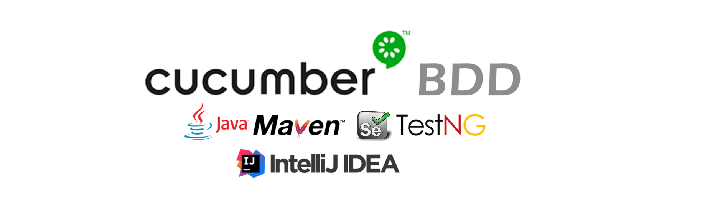

<!-- PROJECT SHIELDS -->

        
      
          
          

<!-- PROJECT LOGO -->
 

  

  <h3 align="center">WebAutomation.Maven</h3>
   

     
    <a href="#about-the-project"><strong>Read Instructions »</strong></a>
     
       
    <a href="https://github.com/mahmoudazaid/WebAutomation.Maven/wiki">Read the Wiki</a>
    .
    <a href="https://github.com/mahmoudazaid/WebAutomation.Maven/issues">Report Bug</a>
    ·
    <a href="https://github.com/mahmoudazaid/WebAutomation.Maven/issues">Request Feature</a>
  

# WebAutomation.Maven

<!-- TABLE OF CONTENTS -->
## Table of Contents

* [About the Project](#about-the-project)
  * [Built With](#built-with)
* [Getting Started](#getting-started)
  * [Prerequisites](#prerequisites)
  * [Installation](#installation)
* [Usage](#usage)
* [Contributing](#contributing)
* [Contact](#contact)

<!-- ABOUT THE PROJECT -->

## About The Project

This project for build a powerful testing framework to test Web applications, the designe pattern that used POM,
we are use (http://demo.nopcommerce.com) for testing purposes

### Built With
The Framework built with below main packages
* [Maven](http://maven.apache.org/)
* [Selenium](https://www.seleniumhq.org/)
* [TestNG](https://testng.org/doc/)
